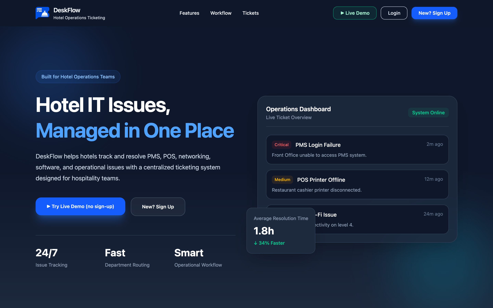
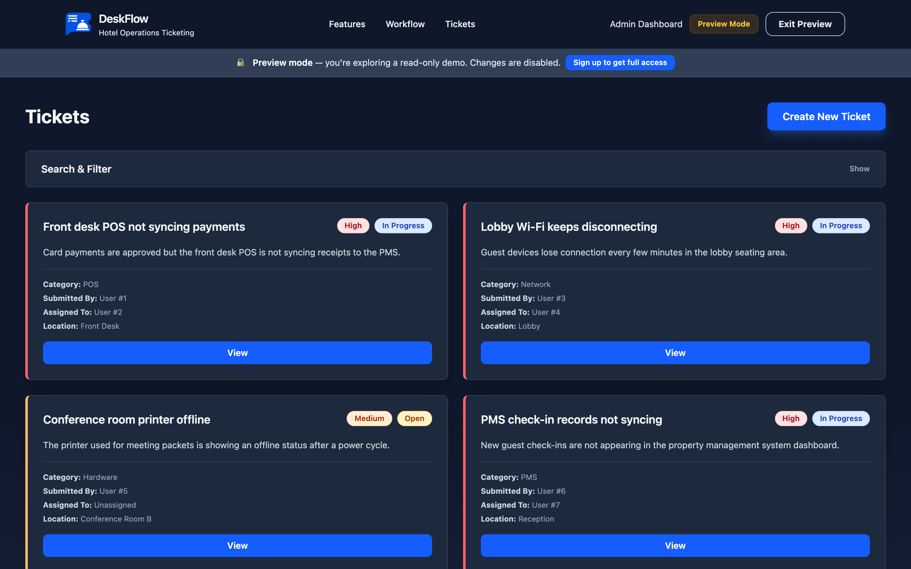
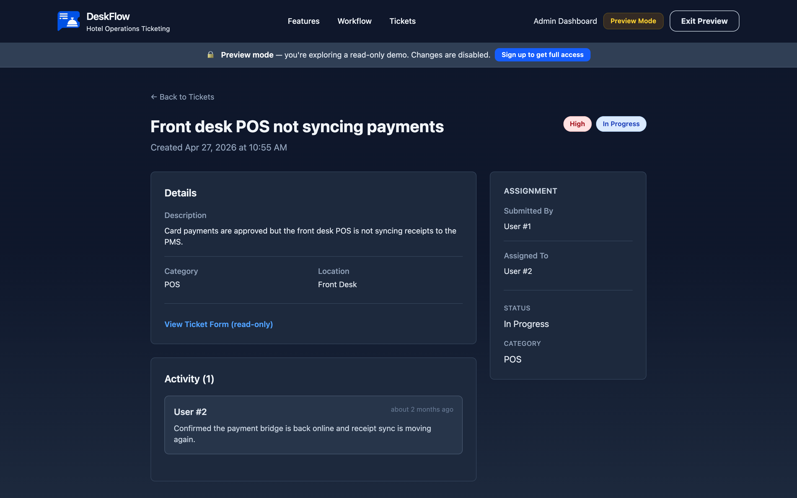
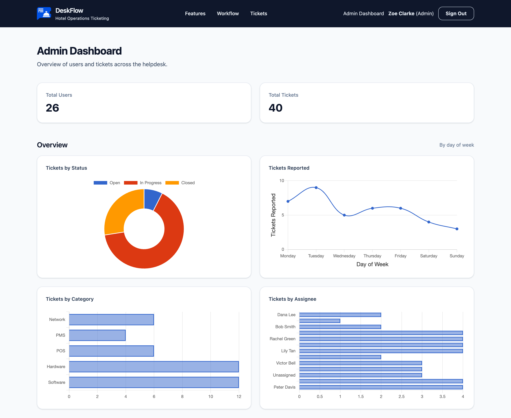

<div align="center">
  

# DeskFlow

**A modern helpdesk and ticketing platform for hotel & operations teams.**

Staff report issues in seconds, managers keep every request moving, and admins get a single place to oversee people and tickets.

**[✨ Try the Live Demo → deskflow.dev](https://deskflow.dev)**

_One-click preview mode — explore the full app instantly, no sign-up required._




</div>

---

## Overview

DeskFlow is a full-stack Rails 8 application that digitizes the internal support workflow of a hotel or operations team. It replaces scattered phone calls and hallway requests with a structured ticket pipeline — from submission, through assignment and discussion, to resolution — with role-based access control at every layer.

The app is fully server-rendered with Hotwire, styled with Tailwind CSS v4, and deployed as a Docker container behind Thruster.

## Features

**🎫 Ticket lifecycle**
- Create, edit, and track tickets with status (`Open → In Progress → Closed`), priority, and hotel-specific categories (Hardware, Software, Network, POS, PMS)
- One-click **claim** and **close** actions for responders
- Smart status transitions — a ticket automatically moves to *In Progress* the moment it's assigned
- Threaded comments on every ticket for discussion and history

**🔍 Search & filtering**
- Full-text search across ticket titles and descriptions
- Composable filters by status, priority, and category, built with chainable ActiveRecord scopes
- Fast pagination with Pagy

**🔐 Authentication & authorization**
- Devise-backed authentication with four roles: `admin`, `manager`, `staff`, and `preview`
- Server-side enforcement on every request — not just hidden buttons

**📊 Admin dashboard**
- Live analytics: tickets by status, category, and assignee, plus a reported-per-day trend chart
- Complete user and ticket registries in one place
- Restricted to admins and managers

**👀 One-click demo mode**
- Visitors can explore the entire app as a locked-down, **read-only preview account** without registering
- Every write is blocked at the controller layer via a global `before_action`, and the behavior is covered by dedicated integration tests

## Screenshots

<table>
  <tr>
    <td align="center" width="50%">
      
      <em>Ticket queue — search, filters, priority & status at a glance</em>
    </td>
    <td align="center" width="50%">
      
      <em>Ticket detail — assignment, status, and activity thread</em>
    </td>
  </tr>
  <tr>
    <td align="center" colspan="2">
      
      <em>Admin dashboard — live analytics on status, volume, category, and assignee workload</em>
    </td>
  </tr>
</table>

## Tech stack

| Layer | Technology |
| --- | --- |
| Backend | Ruby 3.4 · Rails 8.0 |
| Database | PostgreSQL |
| Frontend | Hotwire (Turbo + Stimulus) · Import Maps · Tailwind CSS v4 |
| Auth | Devise |
| Background jobs, cache & websockets | Solid Queue · Solid Cache · Solid Cable (database-backed — no Redis) |
| Pagination | Pagy |
| Server & deployment | Puma · Thruster · Docker · Kamal-ready |
| Testing & linting | Minitest (models, controllers, integration) · RuboCop (Rails Omakase) |

## Engineering highlights

- **Read-only demo done right** — the preview role is enforced with a single global `before_action` guard rather than per-controller checks, so no future endpoint can accidentally leak write access. Integration tests assert the lockdown holds.
- **Rails 8 "Solid" architecture** — caching, background jobs, and Action Cable all run on PostgreSQL, keeping the production footprint to just the app and its database.
- **Lean, idiomatic domain model** — filtering is expressed as composable scopes, and business rules (like auto-advancing status on assignment) live in the model layer where they're testable in isolation.
- **Zero-build JavaScript** — Import Maps and Hotwire deliver an interactive UI without a Node build pipeline.

## Getting started

### Prerequisites

- Ruby 3.4.6
- PostgreSQL
- Bundler

### Setup

```bash
git clone https://github.com/Ahmed-Alsheiba/DeskFlow.git
cd DeskFlow
bundle install
bin/rails db:create db:migrate db:seed
```

### Run the app

```bash
bin/dev
```

Then open [http://localhost:3000](http://localhost:3000).

### Seeded accounts

The seed data creates an admin, several managers, and a roster of staff users so every role can be tested locally. All seeded accounts share the password `password`.

### Run the tests

```bash
bin/rails test
```

## Roles at a glance

| Role | Capabilities |
| --- | --- |
| **Staff** | Submit tickets, comment, and track their requests |
| **Manager** | Everything staff can do, plus the admin dashboard, claiming, and assignment |
| **Admin** | Full access to all users, tickets, and the admin dashboard |
| **Preview** | Read-only demo account — can browse everything, can change nothing |

## Deployment

DeskFlow ships with a production `Dockerfile` and is configured for [Kamal](https://kamal-deploy.org) deployments, with Thruster providing HTTP caching, compression, and asset acceleration in front of Puma. The live instance runs at **[deskflow.dev](https://deskflow.dev)**.

---

<div align="center">
  Built by <a href="https://github.com/Ahmed-Alsheiba">Ahmed AlShaiba</a> · <a href="https://deskflow.dev">deskflow.dev</a>
</div>
